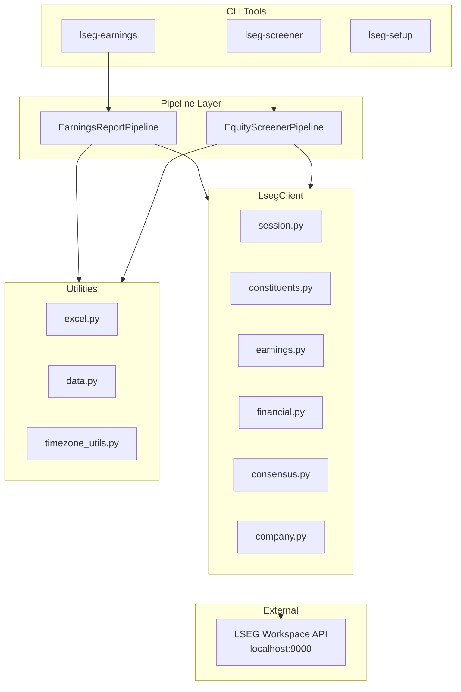
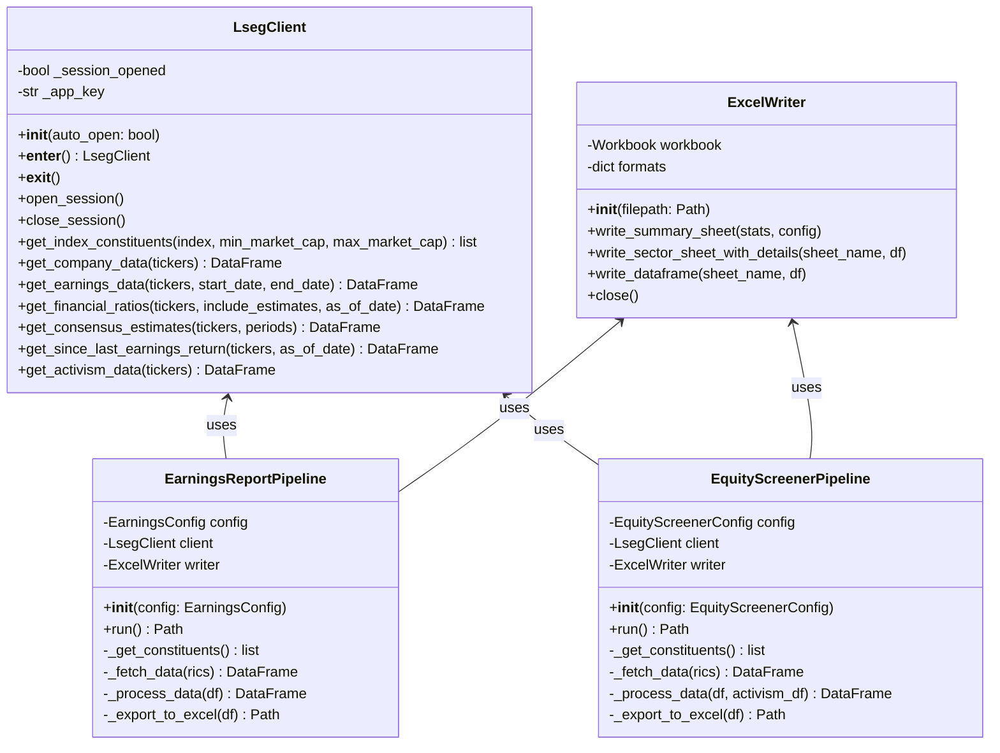
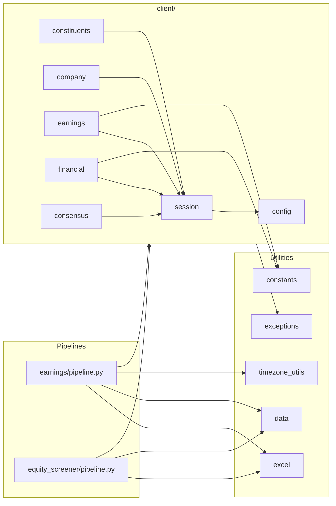
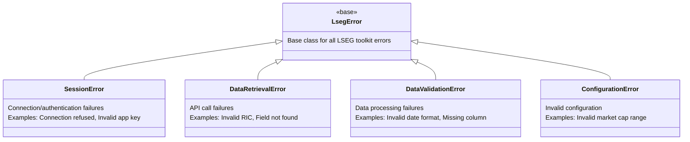
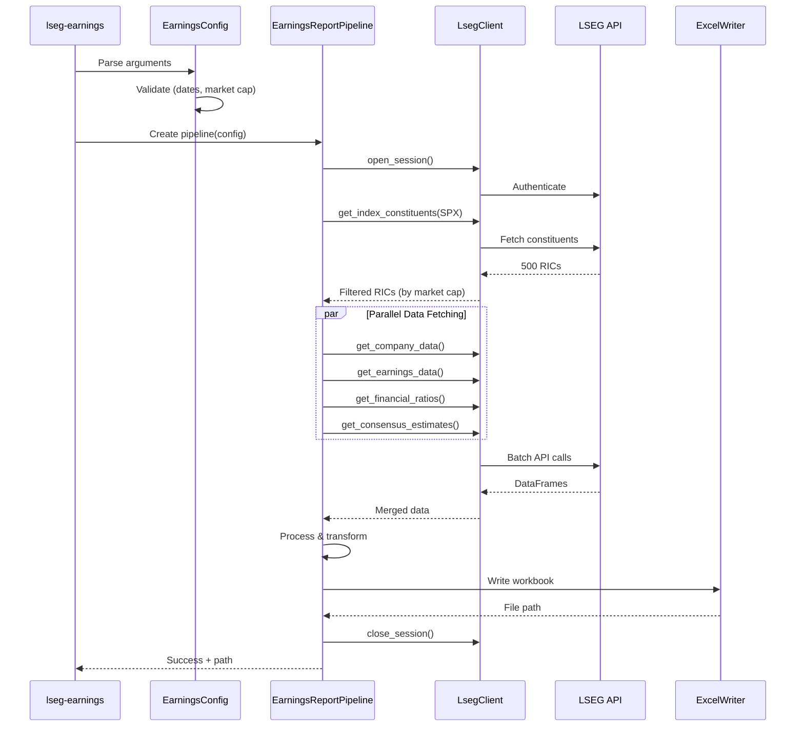
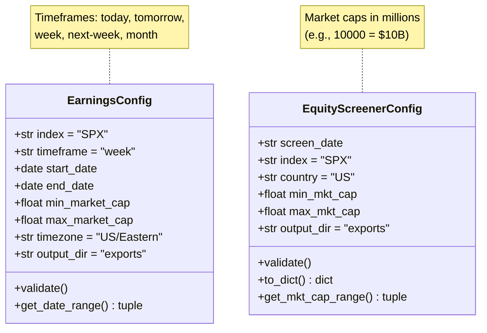
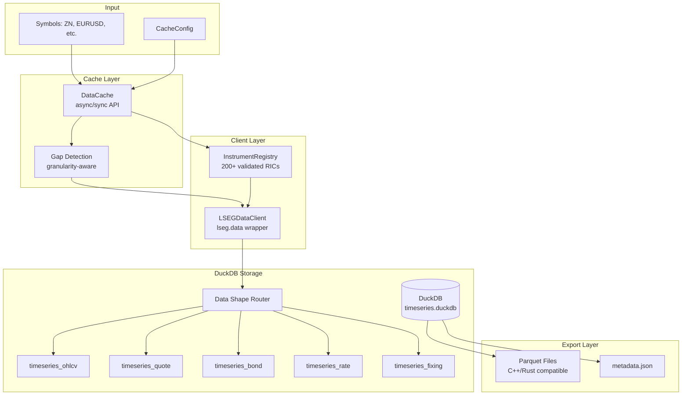

# Architecture

System design and architecture documentation for the LSEG Toolkit.

## Table of Contents

- [Overview](#overview)
- [System Diagrams](#system-diagrams)
- [Data Flow](#data-flow)
- [Module Responsibilities](#module-responsibilities)
- [Key Design Decisions](#key-design-decisions)
- [Error Handling](#error-handling)
- [Testing Strategy](#testing-strategy)

## Overview

The LSEG Toolkit is a modular Python package for extracting and analyzing financial data from the LSEG (London Stock Exchange Group) API. It provides both CLI tools and a Python API for data retrieval.

## System Diagrams

### High-Level Architecture



### Class Diagram: LsegClient



### Module Dependencies



### Exception Hierarchy



### Data Flow: Earnings Report



### Configuration Dataclasses



## Data Flow

The sequence diagram above shows the detailed data flow for the Earnings Report pipeline.
Both pipelines follow a similar pattern:

1. **CLI Input** → Parse and validate arguments
2. **Configuration** → Create typed config dataclass
3. **Pipeline Execution** → Orchestrate API calls via LsegClient
4. **Data Processing** → Merge, transform, calculate derived metrics
5. **Excel Export** → Write formatted workbook to exports/

### Key Differences Between Pipelines

| Aspect | Earnings Report | Equity Screener |
|--------|-----------------|-----------------|
| **Primary Focus** | Upcoming earnings dates | Valuation metrics |
| **Unique Data** | Earnings times, consensus estimates | Activism tracking |
| **Time Handling** | Converts GMT → local timezone | Historical snapshots |
| **Excel Layout** | Collapsible detail rows | One sheet per sector |

## Module Responsibilities

### Client Layer (`src/lseg_toolkit/client/`)

| Module | Purpose |
|--------|---------|
| `session.py` | LSEG session management, authentication, context manager |
| `constituents.py` | Index constituent retrieval, market cap filtering |
| `company.py` | Company master data (name, sector, exchange) |
| `earnings.py` | Earnings dates, times, and confirmation status |
| `financial.py` | Financial ratios and valuation metrics |
| `consensus.py` | Analyst estimates (EPS, revenue) |
| `config.py` | API configuration and app key management |

### Pipeline Layer

| Module | Purpose |
|--------|---------|
| `earnings/pipeline.py` | Orchestrates earnings report generation |
| `earnings/config.py` | Configuration dataclass with validation |
| `earnings/cli.py` | argparse CLI interface |
| `equity_screener/pipeline.py` | Orchestrates equity screening |
| `equity_screener/config.py` | Configuration dataclass with validation |
| `equity_screener/cli.py` | argparse CLI interface |
| `timeseries/pipeline.py` | Orchestrates time series extraction |
| `timeseries/config.py` | Configuration dataclass for time series |
| `timeseries/cli.py` | argparse CLI interface (lseg-extract) |

### Time Series Layer (`src/lseg_toolkit/timeseries/`)

| Module | Purpose |
|--------|---------|
| `cache.py` | Async cache layer with gap detection and batch fetching |
| `client.py` | LSEG data client (wraps lseg.data API) |
| `duckdb_storage.py` | DuckDB persistence with shape-specific tables |
| `rolling.py` | Continuous contract construction and roll detection |
| `constants.py` | CME↔LSEG symbol mappings (200+ validated RICs) |
| `enums.py` | Asset classes, granularity, data shapes, roll methods |
| `models/` | Dataclass models for instruments and time series |

### Utility Layer

| Module | Purpose |
|--------|---------|
| `data.py` | DataFrame transformations, column operations |
| `excel.py` | Excel export with xlsxwriter formatting |
| `timezone_utils.py` | GMT to local timezone conversion |

## Key Design Decisions

### 1. Modular Client Architecture

**Why:** Each data type (earnings, financial, consensus) has its own module.

**Benefits:**
- Easier to test individual components
- Clear separation of concerns
- Simpler to add new data types

**Trade-off:** More files to navigate, but IDE features make this manageable.

### 2. Pipeline Pattern

**Why:** CLI tools use a pipeline class that orchestrates multiple API calls.

**Benefits:**
- Encapsulates complex workflows
- Easy to test with mock client
- Consistent error handling

**Example:**
```python
class EarningsReportPipeline:
    def __init__(self, config: EarningsConfig):
        self.config = config
        self.client = LsegClient()  # Creates session internally

    def run(self) -> Path:
        rics = self._get_constituents()
        df = self._fetch_earnings(rics)
        df = self._fetch_consensus(df)
        return self._export_to_excel(df)
```

### 3. Configuration Dataclasses

**Why:** All configuration is captured in typed dataclasses.

**Benefits:**
- Validation at construction time
- IDE autocompletion
- Easy to serialize/deserialize
- Clear documentation of options

**Example:**
```python
@dataclass
class EarningsConfig:
    index: str = "SPX"
    timeframe: str = "week"
    min_market_cap: float | None = None
    max_market_cap: float | None = None
    timezone: str = "US/Eastern"
```

### 4. Context Manager for Sessions

**Why:** LsegClient uses `__enter__`/`__exit__` for automatic cleanup.

**Benefits:**
- Session is always properly closed
- Works with `with` statement
- Exception-safe

**Example:**
```python
with LsegClient() as client:
    data = client.get_earnings_data(tickers)
# Session automatically closed
```

### 5. Historical Snapshots

**Why:** Financial data queries support `as_of_date` parameter.

**Benefits:**
- Reproduce historical analysis
- Compare valuations over time
- Consistent point-in-time data

**Example:**
```python
# Get valuations as of month-end
ratios = client.get_financial_ratios(tickers, as_of_date="2024-12-31")
```

## Error Handling

The toolkit uses a custom exception hierarchy (see diagram above in [System Diagrams](#exception-hierarchy)).

| Exception | When Raised | Example |
|-----------|-------------|---------|
| `SessionError` | Connection/auth failures | LSEG Workspace not running |
| `DataRetrievalError` | API call failures | Invalid RIC, field not found |
| `DataValidationError` | Data processing failures | Missing required column |
| `ConfigurationError` | Invalid configuration | min_cap > max_cap |

All exceptions inherit from `LsegError` for easy catching:

```python
try:
    with LsegClient() as client:
        data = client.get_earnings_data(tickers)
except LsegError as e:
    print(f"LSEG error: {e}")
```

### Graceful Degradation

Pipelines handle missing data gracefully:
- Missing fields return `None` or empty strings
- Partial data still produces output
- Warnings logged for unexpected conditions

## Testing Strategy

### Test Categories

| Category | Location | Purpose |
|----------|----------|---------|
| Unit tests | `tests/test_*.py` | Test individual functions |
| Integration tests | `tests/test_*_client.py` | Test with real LSEG API |
| Pipeline tests | `tests/earnings/`, `tests/equity_screener/` | Test end-to-end workflows |

### Test Markers

```python
@pytest.mark.integration  # Requires LSEG connection
@pytest.mark.slow         # Takes > 10 seconds
@pytest.mark.unit         # No external dependencies
```

## Time Series Module Architecture

### Overview

The timeseries module provides functionality for extracting, storing, and exporting historical market data for bond futures, FX, OIS curves, Treasury yields, and FRAs. Unlike the earnings/screener modules which export to Excel, timeseries data is stored in DuckDB with shape-specific tables and can be exported to Parquet for high-performance consumption by C++/Rust applications.

### Data Flow



### Key Classes

#### DataCache (Recommended Entry Point)

Cache-first data access with async support:

```python
from lseg_toolkit.timeseries import DataCache, CacheConfig

cache = DataCache(CacheConfig(db_path="data/timeseries.duckdb"))

# Sync usage
df = cache.get_or_fetch("TYc1", start="2024-01-01", end="2024-12-31")

# Async batch usage
results = await cache.async_get_or_fetch_many(
    ["TYc1", "USc1", "EUR="],
    start="2024-01-01",
    end="2024-12-31"
)
```

**Features:**
- Granularity-aware gap detection (daily data doesn't satisfy 5min requests)
- Instrument validation against 200+ known RICs
- Async/await for parallel multi-RIC fetching
- Progress tracking with callbacks

#### InstrumentRegistry

Validates RICs against known instruments from `constants.py`:

```python
from lseg_toolkit.timeseries import InstrumentRegistry, get_registry

registry = get_registry()
registry.validate_ric("TYc1")  # OK
registry.validate_ric("INVALID")  # Raises InstrumentNotFoundError
```

### Storage Schema (DuckDB)

Data is routed to shape-specific tables based on asset class:

| Data Shape | Table | Asset Classes |
|------------|-------|---------------|
| OHLCV | `timeseries_ohlcv` | Futures, equities, commodities |
| Quote | `timeseries_quote` | FX, OIS, IRS, FRA |
| Bond | `timeseries_bond` | Government bonds (yields + analytics) |
| Rate | `timeseries_rate` | Swaps, repos |
| Fixing | `timeseries_fixing` | SOFR, ESTR, SONIA |

**Instrument Tables:**
- `instruments`: Master registry (symbol, asset_class, lseg_ric)
- `instrument_future`: Futures metadata (expiry, tick size, point value)
- `instrument_fx`: FX pair details (base/quote currency)
- `instrument_rate`: Rate details (tenor, day count, payment frequency)
- `instrument_bond`: Bond details (coupon, maturity, day count)

For complete schema, see [STORAGE_SCHEMA.md](STORAGE_SCHEMA.md).

### Continuous Contract Construction

The `rolling.py` module implements several roll detection methods:

**VOLUME_SWITCH** (default):
- Roll when back month volume exceeds front month volume
- Most common in industry practice

**FIXED_DAYS**:
- Roll N days before expiration
- Predictable schedule, but may roll into illiquid contracts

**EXPIRY**:
- Roll on expiration day
- Matches LSEG's default `c1` behavior

**Price Adjustment Types:**

1. **Ratio Adjusted** (recommended):
   - Backward adjust prices by multiplying by roll ratio
   - Preserves percentage returns
   - Formula: `adj_price = raw_price * (to_price / from_price)`

2. **Difference Adjusted**:
   - Backward adjust by adding roll gap
   - Preserves absolute price moves
   - Formula: `adj_price = raw_price + (to_price - from_price)`

3. **Unadjusted**:
   - No adjustment, just stitch contracts
   - Shows actual price levels but creates gaps at rolls

### Symbol Resolution (CME ↔ LSEG)

The `constants.py` module maintains bidirectional mappings:

**US Treasury Futures:**
```python
ZN → TY   # 10-Year T-Note
ZB → US   # 30-Year T-Bond
ZF → FV   # 5-Year T-Note
ZT → TU   # 2-Year T-Note
UB → UB   # Ultra 30-Year
```

**FX Spot RICs:**
```python
EURUSD → EUR=
GBPUSD → GBP=
USDJPY → JPY=
```

**OIS Curve:**
```python
1M, 3M, 1Y, 5Y, 10Y → USD{tenor}OIS=
```

**Treasury Yields:**
```python
1M, 3M, 2Y, 10Y, 30Y → US{tenor}T=RRPS
```

### Export Layer (Parquet)

**Why Parquet?**
- Columnar storage (efficient for time series analysis)
- Strong typing (preserves date/time/numeric precision)
- Cross-language compatibility (C++/Rust via Arrow)
- Compression (smaller files than CSV)

**Export Structure:**
```
data/parquet/
├── metadata.json           # Instrument registry, date ranges, granularity
├── ZN_daily.parquet        # 10Y futures continuous
├── EURUSD_daily.parquet    # EUR/USD spot
└── USD1YOIS_daily.parquet  # 1Y OIS rate
```

**metadata.json** contains:
- Instrument details (symbol, RIC, asset class)
- Date range coverage
- Granularity
- Roll events (for continuous contracts)

### Supported Granularities

| Granularity | LSEG Interval | Retention | Use Case |
|-------------|---------------|-----------|----------|
| `TICK` | tick | ~30 days | HFT research |
| `MINUTE_1` | 1min | ~90 days | Intraday analysis |
| `MINUTE_5` | 5min | ~90 days | Intraday analysis |
| `MINUTE_10` | 10min | ~90 days | Intraday analysis |
| `MINUTE_30` | 30min | ~90 days | Intraday analysis |
| `HOURLY` | hourly | ~90 days | Intraday analysis |
| `DAILY` | daily | Full history | Standard analysis |
| `WEEKLY` | weekly | Full history | Long-term trends |
| `MONTHLY` | monthly | Full history | Macro analysis |

**Note:** 15-minute intervals are NOT supported by LSEG API.

### Asset Class Support

| Asset Class | Symbols | RIC Pattern | Fields |
|-------------|---------|-------------|--------|
| Bond Futures | ZN, ZB, FGBL | `TYc1`, `USc1` | OHLCV + settle + OI |
| FX Spot | EURUSD, USDJPY | `EUR=`, `JPY=` | Bid/Ask/High/Low |
| OIS Rates | 1M, 3M, 1Y, 5Y | `USD1MOIS=` | Close (rate) |
| Treasury Yields | 2Y, 10Y, 30Y | `US10YT=RRPS` | Close (yield) |
| FRAs | 1X4, 3X6 | `USD3X6F=` | Bid/Ask |

### Error Handling

The timeseries module uses custom exceptions from `lseg_toolkit.exceptions`:

- **`DataRetrievalError`**: API fetch failures, invalid RICs
- **`StorageError`**: DuckDB operations (save/load failures)
- **`InstrumentNotFoundError`**: Unknown symbol/RIC
- **`ConfigurationError`**: Invalid config (date range, granularity mismatch)

All extraction results are tracked in `ExtractionResult` dataclass:
```python
@dataclass
class ExtractionResult:
    symbol: str
    rows_fetched: int
    start_date: date | None
    end_date: date | None
    success: bool
    error: str | None = None
    roll_events: int = 0
```

### Performance Characteristics

| Operation | Scale | Typical Time |
|-----------|-------|--------------|
| Fetch 1 year daily data | 1 symbol | 2-5 sec |
| Fetch 1 year daily data | 5 symbols (async) | 3-8 sec |
| Build continuous contract | 1 symbol | 1-3 sec |
| DuckDB storage | 250 rows | <100 ms |
| Parquet export | 1 year data | <500 ms |

**Optimization:**
- Async batch fetching with semaphore rate limiting
- DuckDB transactions for bulk inserts
- Shape-specific tables reduce query overhead

## Future Considerations

### Potential Enhancements

1. **Web interface:** Simple Flask/FastAPI dashboard
2. **Real-time streaming:** WebSocket integration for live data

### Extensibility Points

- Add new client modules for additional LSEG data types
- Create new pipeline classes for different analysis workflows
- Extend ExcelWriter for custom formatting requirements

### Technical Debt

1. **Consolidate sector column lookup:** Extract flexible column name detection from `client/financial.py` into shared utility in `data.py`
2. **Unify financial company filtering:** Centralize logic for nullifying debt metrics for financial companies (currently in `client/financial.py` and `equity_screener/pipeline.py`)
3. **Document parallel worker counts:** Clarify why `earnings/pipeline.py` uses 5 workers vs `client/earnings.py` using 11
