# TimescaleDB Storage Schema

This document describes the storage schema for the `jl-lseg-toolkit` time series database.

## Overview

The storage layer uses **TimescaleDB** (PostgreSQL with time-series extensions) for high-performance analytical queries. The schema is organized around **data shapes** rather than asset classes, which normalizes storage by the fundamental structure of the data rather than the instrument type.

### TimescaleDB Features

- **Hypertables**: Time-partitioned tables for efficient time-range queries
- **Compression**: Automatic compression of older chunks (7+ days)
- **Space partitioning**: Hash partitioning by `instrument_id` for multi-instrument queries
- **Continuous aggregates**: Pre-computed rollups (optional)

### Design Principles

1. **Data Shape Normalization**: Different asset classes share the same table if they have the same data structure
2. **Unified Timeseries**: Daily and intraday data share the same table with a `granularity` discriminator
3. **Foreign Key Relationships**: All timeseries tables reference the central `instruments` table
4. **Type-Specific Details**: Separate detail tables store asset-class-specific metadata

## Entity Relationship Diagram

```mermaid
erDiagram
    instruments {
        INTEGER id PK
        VARCHAR symbol UK
        VARCHAR name
        VARCHAR asset_class
        VARCHAR data_shape
        VARCHAR lseg_ric
        VARCHAR exchange
        VARCHAR currency
        VARCHAR description
        TIMESTAMP created_at
        TIMESTAMP updated_at
    }

    instrument_futures {
        INTEGER instrument_id PK,FK
        VARCHAR underlying
        VARCHAR exchange
        DATE expiry_date
        VARCHAR contract_month
        VARCHAR continuous_type
        DOUBLE tick_size
        DOUBLE point_value
    }

    instrument_fx {
        INTEGER instrument_id PK,FK
        VARCHAR base_currency
        VARCHAR quote_currency
        DOUBLE pip_size
        VARCHAR tenor
    }

    instrument_rate {
        INTEGER instrument_id PK,FK
        VARCHAR rate_type
        VARCHAR currency
        VARCHAR tenor
        VARCHAR reference_rate
        VARCHAR day_count
        INTEGER paired_instrument_id FK
    }

    instrument_bond {
        INTEGER instrument_id PK,FK
        VARCHAR issuer_type
        VARCHAR country
        VARCHAR tenor
        DOUBLE coupon_rate
        DATE maturity_date
        VARCHAR credit_rating
        VARCHAR sector
    }

    instrument_fixing {
        INTEGER instrument_id PK,FK
        VARCHAR rate_name
        VARCHAR tenor
        VARCHAR fixing_time
        VARCHAR administrator
    }

    instrument_equity {
        INTEGER instrument_id PK,FK
        VARCHAR exchange
        VARCHAR country
        VARCHAR currency
        VARCHAR sector
        VARCHAR industry
        VARCHAR isin
        VARCHAR cusip
        VARCHAR sedol
        VARCHAR market_cap_category
    }

    instrument_etf {
        INTEGER instrument_id PK,FK
        VARCHAR exchange
        VARCHAR country
        VARCHAR currency
        VARCHAR asset_class_focus
        VARCHAR geography_focus
        VARCHAR benchmark_index
        DOUBLE expense_ratio
        VARCHAR isin
        VARCHAR cusip
        VARCHAR legal_structure
        BOOLEAN is_leveraged
        BOOLEAN is_inverse
    }

    instrument_index {
        INTEGER instrument_id PK,FK
        VARCHAR index_family
        VARCHAR country
        VARCHAR calculation_method
        VARCHAR currency
        INTEGER num_constituents
        DATE base_date
        DOUBLE base_value
    }

    timeseries_ohlcv {
        INTEGER instrument_id PK,FK
        TIMESTAMP ts PK
        DATE session_date
        VARCHAR granularity PK
        DOUBLE open
        DOUBLE high
        DOUBLE low
        DOUBLE close
        DOUBLE volume
        DOUBLE settle
        DOUBLE open_interest
        DOUBLE bid
        DOUBLE ask
        DOUBLE mid
        DOUBLE implied_rate
        DOUBLE vwap
        VARCHAR source_contract
        DOUBLE adjustment_factor
    }

    timeseries_quote {
        INTEGER instrument_id PK,FK
        TIMESTAMP ts PK
        VARCHAR granularity PK
        DOUBLE bid
        DOUBLE ask
        DOUBLE mid
        DOUBLE open_bid
        DOUBLE bid_high
        DOUBLE bid_low
        DOUBLE open_ask
        DOUBLE ask_high
        DOUBLE ask_low
        DOUBLE forward_points
    }

    timeseries_rate {
        INTEGER instrument_id PK,FK
        TIMESTAMP ts PK
        VARCHAR granularity PK
        DOUBLE rate
        DOUBLE bid
        DOUBLE ask
        DOUBLE rate_2
        DOUBLE spread
        VARCHAR reference_rate
        VARCHAR side
    }

    timeseries_bond {
        INTEGER instrument_id PK,FK
        TIMESTAMP ts PK
        VARCHAR granularity PK
        DOUBLE price
        DOUBLE bid
        DOUBLE ask
        DOUBLE yield
        DOUBLE yield_bid
        DOUBLE yield_ask
        DOUBLE yield_high
        DOUBLE yield_low
        DOUBLE duration
        DOUBLE mod_duration
        DOUBLE convexity
        DOUBLE dv01
        DOUBLE credit_spread
        DOUBLE z_spread
        DOUBLE oas
    }

    timeseries_fixing {
        INTEGER instrument_id PK,FK
        DATE date PK
        DOUBLE value
        DOUBLE volume
    }

    roll_events {
        INTEGER id PK
        INTEGER continuous_id FK
        DATE roll_date
        VARCHAR from_contract
        VARCHAR to_contract
        DOUBLE from_price
        DOUBLE to_price
        DOUBLE price_gap
        DOUBLE adjustment_factor
        VARCHAR roll_method
        TIMESTAMP created_at
    }

    extraction_log {
        INTEGER id PK
        INTEGER instrument_id FK
        DATE start_date
        DATE end_date
        VARCHAR granularity
        INTEGER rows_fetched
        TIMESTAMP extracted_at
    }

    instruments ||--o| instrument_futures : "has"
    instruments ||--o| instrument_fx : "has"
    instruments ||--o| instrument_rate : "has"
    instruments ||--o| instrument_bond : "has"
    instruments ||--o| instrument_fixing : "has"
    instruments ||--o| instrument_equity : "has"
    instruments ||--o| instrument_etf : "has"
    instruments ||--o| instrument_index : "has"
    instruments ||--o{ timeseries_ohlcv : "has"
    instruments ||--o{ timeseries_quote : "has"
    instruments ||--o{ timeseries_rate : "has"
    instruments ||--o{ timeseries_bond : "has"
    instruments ||--o{ timeseries_fixing : "has"
    instruments ||--o{ roll_events : "has"
    instruments ||--o{ extraction_log : "has"
    instrument_rate ||--o| instruments : "pairs_with"
```



## Data Shapes

The `data_shape` column in the `instruments` table determines which timeseries table stores data for each instrument.

### Data Shape Classification

| Data Shape | Description | Timeseries Table | Example Instruments |
|------------|-------------|------------------|---------------------|
| `ohlcv` | Exchange-traded with OHLCV bars | `timeseries_ohlcv` | TYc1, ESc1, CLc1, AAPL.O |
| `quote` | Dealer-quoted bid/ask spreads | `timeseries_quote` | EUR=, GBP=, EUR1M= |
| `rate` | Interest rate derivatives | `timeseries_rate` | USD1YOIS=, USDIRS10Y= |
| `bond` | Bond prices and yields | `timeseries_bond` | US10YT=RRPS, DE10YT=RR |
| `fixing` | Daily benchmark fixings | `timeseries_fixing` | USDSOFR=, ESTR=, SONIA= |

### Asset Class to Data Shape Mapping

The system automatically determines the correct data shape based on the asset class:

## OHLCV Notes for STIR / Fed Funds

`timeseries_ohlcv` now also carries the fields needed for Fed Funds continuous
storage and downstream backtests:

- `session_date` — trading/session date used for contract labeling
- `bid`, `ask`, `mid` — intraday quote-derived fields
- `implied_rate` — computed as `100 - price`
- `source_contract` — discrete contract code (for example `FFH26`, `FFJ26`)

For `FF_CONTINUOUS` specifically:

- **daily** rows use `session_date = ts::date`
- **hourly** rows use the LSEG/CME session-date convention rather than raw UTC date
- downstream consumers should use:
  - `ts` for ordering/time
  - `session_date` for trading-day logic
  - `source_contract` for contract-aware analytics

```python
ASSET_CLASS_TO_DATA_SHAPE = {
    # OHLCV (exchange-traded)
    AssetClass.BOND_FUTURES: DataShape.OHLCV,
    AssetClass.STIR_FUTURES: DataShape.OHLCV,
    AssetClass.INDEX_FUTURES: DataShape.OHLCV,
    AssetClass.FX_FUTURES: DataShape.OHLCV,
    AssetClass.COMMODITY_FUTURES: DataShape.OHLCV,  # CLc1, GCc1, NGc1
    AssetClass.EQUITY: DataShape.OHLCV,
    AssetClass.ETF: DataShape.OHLCV,  # SPY.P, QQQ.O
    AssetClass.EQUITY_INDEX: DataShape.OHLCV,  # .SPX, .DJI, .VIX

    # Quote (dealer-quoted)
    AssetClass.FX_SPOT: DataShape.QUOTE,
    AssetClass.FX_FORWARD: DataShape.QUOTE,
    AssetClass.COMMODITY: DataShape.QUOTE,  # XAU=, XAG= (spot commodities are bid/ask)

    # Rate (IR derivatives)
    AssetClass.OIS: DataShape.RATE,
    AssetClass.IRS: DataShape.RATE,
    AssetClass.FRA: DataShape.RATE,
    AssetClass.DEPOSIT: DataShape.RATE,
    AssetClass.REPO: DataShape.RATE,
    AssetClass.CDS: DataShape.RATE,

    # Bond (govt/corp yields)
    AssetClass.GOVT_YIELD: DataShape.BOND,
    AssetClass.CORP_BOND: DataShape.BOND,

    # Fixing (daily benchmark rates)
    AssetClass.FIXING: DataShape.FIXING,
}
```

**Key distinction**: Commodity *futures* (CLc1, GCc1) use OHLCV, but commodity *spot* (XAU=, XAG=) uses Quote because spot metals are dealer-quoted (bid/ask) not exchange-traded.

## Table Definitions

### Master Table: instruments

The central registry for all financial instruments.

```sql
CREATE TABLE instruments (
    id INTEGER PRIMARY KEY,
    symbol VARCHAR NOT NULL UNIQUE,      -- Internal symbol (e.g., 'EURUSD', 'TYc1')
    name VARCHAR NOT NULL,               -- Human-readable name
    asset_class VARCHAR NOT NULL,        -- Asset classification
    data_shape VARCHAR NOT NULL,         -- Routes to correct timeseries table
    lseg_ric VARCHAR NOT NULL,           -- LSEG RIC code (e.g., 'EUR=', 'TYc1')
    exchange VARCHAR,                    -- Exchange code
    currency VARCHAR,                    -- Quote currency
    description VARCHAR,                 -- Full description
    created_at TIMESTAMP DEFAULT current_timestamp,
    updated_at TIMESTAMP DEFAULT current_timestamp
);

CREATE INDEX idx_instruments_symbol ON instruments(symbol);
CREATE INDEX idx_instruments_asset_class ON instruments(asset_class);
CREATE INDEX idx_instruments_data_shape ON instruments(data_shape);
```

**Asset Classes**: `bond_futures`, `stir_futures`, `index_futures`, `fx_futures`, `commodity_futures`, `fx_spot`, `fx_forward`, `ois`, `irs`, `fra`, `deposit`, `repo`, `cds`, `govt_yield`, `corp_bond`, `commodity`, `equity`, `etf`, `equity_index`, `fixing`

**Data Shapes**: `ohlcv`, `quote`, `rate`, `bond`, `fixing`

### Instrument Detail Tables

#### instrument_futures

Stores futures-specific contract details.

```sql
CREATE TABLE instrument_futures (
    instrument_id INTEGER PRIMARY KEY REFERENCES instruments(id),
    underlying VARCHAR NOT NULL,         -- Underlying asset (e.g., 'US10Y', 'ES')
    exchange VARCHAR,                    -- Exchange (CME, EUREX, etc.)
    expiry_date DATE,                    -- Contract expiry date
    contract_month VARCHAR,              -- Month code ('H5', 'M5', 'U5', 'Z5')
    continuous_type VARCHAR DEFAULT 'discrete',  -- 'discrete', 'front', 'back'
    tick_size DOUBLE,                    -- Minimum price increment
    point_value DOUBLE                   -- Dollar value per point
);
```

#### instrument_fx

Stores FX spot and forward details.

```sql
CREATE TABLE instrument_fx (
    instrument_id INTEGER PRIMARY KEY REFERENCES instruments(id),
    base_currency VARCHAR NOT NULL,      -- Base currency (e.g., 'EUR')
    quote_currency VARCHAR NOT NULL,     -- Quote currency (e.g., 'USD')
    pip_size DOUBLE DEFAULT 0.0001,      -- Pip size (0.01 for JPY pairs)
    tenor VARCHAR                        -- NULL for spot, '1W', '1M' for forwards
);
```

#### instrument_rate

Stores interest rate derivative details for QuantLib curve bootstrapping.

```sql
CREATE TABLE instrument_rate (
    instrument_id INTEGER PRIMARY KEY REFERENCES instruments(id),
    rate_type VARCHAR NOT NULL,          -- 'OIS', 'IRS', 'FRA', 'REPO', 'DEPOSIT'
    currency VARCHAR NOT NULL,           -- Currency (USD, EUR, GBP, etc.)
    tenor VARCHAR NOT NULL,              -- Tenor ('1Y', '10Y', '3x6')
    reference_rate VARCHAR,              -- Reference rate ('SOFR', 'EURIBOR', 'SONIA')
    day_count VARCHAR,                   -- Day count convention ('ACT/360', 'ACT/365', 'ACT/ACT')
    payment_frequency VARCHAR,           -- 'annual', 'semiannual', 'quarterly', 'monthly'
    business_day_conv VARCHAR,           -- 'modified_following', 'following', 'preceding'
    calendar VARCHAR,                    -- 'TARGET', 'US', 'UK', 'JP'
    settlement_days INTEGER DEFAULT 2,   -- T+2 for most swaps
    paired_instrument_id INTEGER REFERENCES instruments(id)  -- For paired rates
);
```

**QuantLib Fields**: `payment_frequency`, `business_day_conv`, `calendar`, `settlement_days` are required for proper curve bootstrapping.

#### instrument_bond

Stores government and corporate bond details for QuantLib pricing.

```sql
CREATE TABLE instrument_bond (
    instrument_id INTEGER PRIMARY KEY REFERENCES instruments(id),
    issuer_type VARCHAR NOT NULL,        -- 'GOVT', 'CORP', 'MUNI', 'AGENCY'
    country VARCHAR,                     -- Country code ('US', 'DE', 'GB', 'JP')
    tenor VARCHAR NOT NULL,              -- Tenor ('2Y', '10Y', '30Y')
    coupon_rate DOUBLE,                  -- Coupon rate
    coupon_frequency VARCHAR,            -- 'semiannual' (UST), 'annual' (Bunds), 'quarterly'
    day_count VARCHAR,                   -- 'ACT/ACT', '30/360', 'ACT/365'
    maturity_date DATE,                  -- Maturity date
    settlement_days INTEGER DEFAULT 1,   -- T+1 for UST, T+2 for most others
    credit_rating VARCHAR,               -- Credit rating
    sector VARCHAR                       -- Sector for corporate bonds
);
```

**QuantLib Fields**: `coupon_frequency`, `day_count`, `settlement_days` are required for proper bond pricing.

#### instrument_fixing

Stores overnight rate fixing details.

```sql
CREATE TABLE instrument_fixing (
    instrument_id INTEGER PRIMARY KEY REFERENCES instruments(id),
    rate_name VARCHAR NOT NULL,          -- 'SOFR', 'ESTR', 'SONIA', 'EURIBOR'
    tenor VARCHAR,                       -- NULL for overnight, '3M' for EURIBOR3M
    fixing_time VARCHAR,                 -- Fixing time ('08:00 NY', '11:00 London')
    administrator VARCHAR                -- Administrator ('Fed', 'ECB', 'BoE')
);
```

#### instrument_equity

Stores individual stock details.

```sql
CREATE TABLE instrument_equity (
    instrument_id INTEGER PRIMARY KEY REFERENCES instruments(id),
    exchange VARCHAR,                    -- 'NYSE', 'NASDAQ', 'LSE', 'XETRA', 'TSE'
    country VARCHAR NOT NULL,            -- Country code ('US', 'GB', 'DE', 'JP')
    currency VARCHAR NOT NULL,           -- Quote currency
    sector VARCHAR,                      -- GICS sector
    industry VARCHAR,                    -- GICS industry
    isin VARCHAR,                        -- ISIN identifier
    cusip VARCHAR,                       -- CUSIP (US)
    sedol VARCHAR,                       -- SEDOL (UK)
    market_cap_category VARCHAR          -- 'large_cap', 'mid_cap', 'small_cap'
);
```

#### instrument_etf

Stores ETF/fund details with LSEG-sourced metadata.

```sql
CREATE TABLE instrument_etf (
    instrument_id INTEGER PRIMARY KEY REFERENCES instruments(id),
    exchange VARCHAR,                    -- 'ARCX' (NYSE Arca), 'XXXX' (NASDAQ)
    country VARCHAR NOT NULL,            -- Country code
    currency VARCHAR NOT NULL,           -- Quote currency
    asset_class_focus VARCHAR,           -- 'Equity', 'Fixed Income', 'Commodity'
    geography_focus VARCHAR,             -- 'United States of America', 'Global', etc.
    benchmark_index VARCHAR,             -- 'S&P 500 TR', 'NASDAQ 100 TR', etc.
    expense_ratio DOUBLE,                -- Expense ratio (if available)
    isin VARCHAR,                        -- ISIN identifier
    cusip VARCHAR,                       -- CUSIP identifier
    legal_structure VARCHAR,             -- 'Exchange-Traded Open-end Funds', 'Grantor Trusts'
    is_leveraged BOOLEAN DEFAULT FALSE,  -- Leveraged ETF (2x, 3x)
    is_inverse BOOLEAN DEFAULT FALSE     -- Inverse ETF (short exposure)
);
```

**LSEG Field Sources**:
- `benchmark_index`: `TR.IndexName`
- `geography_focus`: `TR.FundGeographicFocus`
- `legal_structure`: `TR.FundLegalStructure`
- `isin`, `cusip`: `TR.ISIN`, `TR.CUSIP`
- `market_cap` (AUM): `TR.CompanyMarketCap`

#### instrument_index

Stores spot index details (e.g., .SPX, .DJI, .VIX).

```sql
CREATE TABLE instrument_index (
    instrument_id INTEGER PRIMARY KEY REFERENCES instruments(id),
    index_family VARCHAR,                -- 'S&P', 'Dow Jones', 'FTSE', 'STOXX', 'VIX'
    country VARCHAR,                     -- Primary country
    calculation_method VARCHAR,          -- 'price_weighted', 'cap_weighted', 'equal_weighted'
    currency VARCHAR NOT NULL,           -- Quote currency
    num_constituents INTEGER,            -- Number of components
    base_date DATE,                      -- Index inception/base date
    base_value DOUBLE                    -- Index base value (typically 100 or 1000)
);
```

### Timeseries Tables

#### timeseries_ohlcv

OHLCV data for exchange-traded instruments (futures, equities, ETFs, indices, commodities).

```sql
CREATE TABLE timeseries_ohlcv (
    instrument_id INTEGER NOT NULL REFERENCES instruments(id),
    ts TIMESTAMP NOT NULL,               -- Timestamp (end of bar)
    granularity VARCHAR NOT NULL,        -- 'minute', '5min', '30min', 'hourly', 'daily'
    open DOUBLE,
    high DOUBLE,
    low DOUBLE,
    close DOUBLE NOT NULL,
    volume DOUBLE,
    settle DOUBLE,                       -- Settlement price (futures)
    open_interest DOUBLE,                -- Open interest (futures)
    vwap DOUBLE,                         -- Volume-weighted average price
    source_contract VARCHAR,             -- Source contract for continuous series
    adjustment_factor DOUBLE DEFAULT 1.0, -- Ratio adjustment for continuous series
    PRIMARY KEY (instrument_id, ts, granularity)
);

CREATE INDEX idx_timeseries_ohlcv_ts ON timeseries_ohlcv(instrument_id, ts DESC);
```

#### timeseries_quote

Quote data for dealer-quoted instruments (FX spot, FX forwards).

```sql
CREATE TABLE timeseries_quote (
    instrument_id INTEGER NOT NULL REFERENCES instruments(id),
    ts TIMESTAMP NOT NULL,
    granularity VARCHAR NOT NULL,
    bid DOUBLE,
    ask DOUBLE,
    mid DOUBLE,
    open_bid DOUBLE,
    bid_high DOUBLE,
    bid_low DOUBLE,
    open_ask DOUBLE,
    ask_high DOUBLE,
    ask_low DOUBLE,
    forward_points DOUBLE,               -- Forward points (for FX forwards)
    PRIMARY KEY (instrument_id, ts, granularity)
);

CREATE INDEX idx_timeseries_quote_ts ON timeseries_quote(instrument_id, ts DESC);
```

#### timeseries_rate

Rate data for interest rate derivatives (OIS, IRS, FRA, Repo, CDS). Includes OHLC-style fields for intraday rate analysis.

```sql
CREATE TABLE timeseries_rate (
    instrument_id INTEGER NOT NULL REFERENCES instruments(id),
    ts TIMESTAMP NOT NULL,
    granularity VARCHAR NOT NULL,
    rate DOUBLE NOT NULL,                -- Primary rate (mid of bid/ask)
    bid DOUBLE,
    ask DOUBLE,
    open_rate DOUBLE,                    -- Opening rate (mid of OPEN_BID/OPEN_ASK)
    high_rate DOUBLE,                    -- High rate of day (BID_HIGH_1)
    low_rate DOUBLE,                     -- Low rate of day (BID_LOW_1)
    rate_2 DOUBLE,                       -- Secondary rate (floating leg / reverse repo)
    spread DOUBLE,                       -- Spread over reference
    reference_rate VARCHAR,              -- Reference rate used
    side VARCHAR,                        -- 'PAY_FIXED', 'RECEIVE_FIXED', 'REPO', 'REVERSE'
    PRIMARY KEY (instrument_id, ts, granularity)
);

CREATE INDEX idx_timeseries_rate_ts ON timeseries_rate(instrument_id, ts DESC);
```

**LSEG Field Mapping:**
- `rate` = mid of BID/ASK
- `open_rate` = mid of OPEN_BID/OPEN_ASK
- `high_rate` = BID_HIGH_1 (rates quoted on bid side)
- `low_rate` = BID_LOW_1

#### timeseries_bond

Bond data with price, yield, and analytics. Includes fields needed for QuantLib bond pricing.

```sql
CREATE TABLE timeseries_bond (
    instrument_id INTEGER NOT NULL REFERENCES instruments(id),
    ts TIMESTAMP NOT NULL,
    granularity VARCHAR NOT NULL,
    price DOUBLE,                        -- Clean price
    dirty_price DOUBLE,                  -- Full price (clean + accrued interest)
    accrued_interest DOUBLE,             -- Accrued interest since last coupon
    bid DOUBLE,
    ask DOUBLE,
    open_price DOUBLE,                   -- Opening price (MID_OPEN)
    open_yield DOUBLE,                   -- Opening yield (OPEN_YLD)
    yield DOUBLE NOT NULL,               -- Yield to maturity
    yield_bid DOUBLE,
    yield_ask DOUBLE,
    yield_high DOUBLE,
    yield_low DOUBLE,
    mac_duration DOUBLE,                 -- Macaulay duration (for immunization)
    mod_duration DOUBLE,                 -- Modified duration (for risk)
    convexity DOUBLE,
    dv01 DOUBLE,                         -- Dollar value of 1bp (BPV)
    z_spread DOUBLE,                     -- Z-spread
    oas DOUBLE,                          -- Option-adjusted spread
    PRIMARY KEY (instrument_id, ts, granularity)
);

-- QuantLib Bond Pricing Notes:
-- dirty_price = price + accrued_interest
-- LSEG provides accrued interest for treasuries via ACCRUED_INT field
-- If dirty_price not provided, calculate as: dirty_price = price + accrued_interest

CREATE INDEX idx_timeseries_bond_ts ON timeseries_bond(instrument_id, ts DESC);
```

#### timeseries_fixing

Daily fixing rates (SOFR, ESTR, SONIA, EURIBOR).

```sql
CREATE TABLE timeseries_fixing (
    instrument_id INTEGER NOT NULL REFERENCES instruments(id),
    date DATE NOT NULL,                  -- Fixing date (not publication date)
    value DOUBLE NOT NULL,               -- Fixing value
    volume DOUBLE,                       -- Transaction volume (SOFR)
    PRIMARY KEY (instrument_id, date)
);

CREATE INDEX idx_timeseries_fixing_date ON timeseries_fixing(instrument_id, date DESC);
```

### Hypertable Configuration

All timeseries tables are converted to TimescaleDB hypertables for optimized time-series performance:

```sql
-- Convert to hypertables with 1-month chunks
SELECT create_hypertable('timeseries_ohlcv', 'ts', chunk_time_interval => INTERVAL '1 month');
SELECT create_hypertable('timeseries_quote', 'ts', chunk_time_interval => INTERVAL '1 month');
SELECT create_hypertable('timeseries_rate', 'ts', chunk_time_interval => INTERVAL '1 month');
SELECT create_hypertable('timeseries_bond', 'ts', chunk_time_interval => INTERVAL '1 month');
SELECT create_hypertable('timeseries_fixing', 'date', chunk_time_interval => INTERVAL '1 year');

-- Add space partitioning by instrument_id (4 partitions)
SELECT add_dimension('timeseries_ohlcv', by_hash('instrument_id', 4));
SELECT add_dimension('timeseries_quote', by_hash('instrument_id', 4));
SELECT add_dimension('timeseries_rate', by_hash('instrument_id', 4));
SELECT add_dimension('timeseries_bond', by_hash('instrument_id', 4));
```

### Compression Policies

Automatic compression is enabled for older data:

```sql
-- Enable compression
ALTER TABLE timeseries_ohlcv SET (
    timescaledb.compress,
    timescaledb.compress_segmentby = 'instrument_id, granularity',
    timescaledb.compress_orderby = 'ts DESC'
);

-- Auto-compress chunks older than 7 days
SELECT add_compression_policy('timeseries_ohlcv', INTERVAL '7 days');
SELECT add_compression_policy('timeseries_quote', INTERVAL '7 days');
SELECT add_compression_policy('timeseries_rate', INTERVAL '7 days');
SELECT add_compression_policy('timeseries_bond', INTERVAL '7 days');
SELECT add_compression_policy('timeseries_fixing', INTERVAL '30 days');
```

### Metadata Tables

#### roll_events

Tracks roll events for continuous futures contracts.

```sql
CREATE TABLE roll_events (
    id INTEGER PRIMARY KEY,
    continuous_id INTEGER NOT NULL REFERENCES instruments(id),
    roll_date DATE NOT NULL,
    from_contract VARCHAR NOT NULL,
    to_contract VARCHAR NOT NULL,
    from_price DOUBLE NOT NULL,
    to_price DOUBLE NOT NULL,
    price_gap DOUBLE NOT NULL,
    adjustment_factor DOUBLE NOT NULL,
    roll_method VARCHAR NOT NULL,
    created_at TIMESTAMP DEFAULT current_timestamp
);

CREATE INDEX idx_roll_events_continuous ON roll_events(continuous_id, roll_date DESC);
```

#### extraction_log

Logs data extraction events for auditing.

```sql
CREATE TABLE extraction_log (
    id INTEGER PRIMARY KEY,
    instrument_id INTEGER NOT NULL REFERENCES instruments(id),
    start_date DATE NOT NULL,
    end_date DATE NOT NULL,
    granularity VARCHAR NOT NULL,
    rows_fetched INTEGER NOT NULL,
    extracted_at TIMESTAMP DEFAULT current_timestamp
);
```

#### extraction_progress

Tracks batch extraction progress.

```sql
CREATE TABLE extraction_progress (
    id INTEGER PRIMARY KEY,
    asset_class VARCHAR NOT NULL,
    instrument VARCHAR NOT NULL,
    start_date DATE NOT NULL,
    end_date DATE NOT NULL,
    status VARCHAR DEFAULT 'pending',    -- 'pending', 'running', 'complete', 'failed'
    rows_fetched INTEGER,
    started_at TIMESTAMP,
    completed_at TIMESTAMP,
    error_message VARCHAR
);

CREATE INDEX idx_progress ON extraction_progress(asset_class, instrument, status);
```

### Views

#### data_coverage

Summary view of data coverage across all instruments.

```sql
CREATE VIEW data_coverage AS
SELECT
    i.symbol,
    i.asset_class,
    i.data_shape,
    CASE i.data_shape
        WHEN 'ohlcv' THEN (SELECT MIN(ts)::DATE FROM timeseries_ohlcv WHERE instrument_id = i.id)
        WHEN 'quote' THEN (SELECT MIN(ts)::DATE FROM timeseries_quote WHERE instrument_id = i.id)
        WHEN 'rate' THEN (SELECT MIN(ts)::DATE FROM timeseries_rate WHERE instrument_id = i.id)
        WHEN 'bond' THEN (SELECT MIN(ts)::DATE FROM timeseries_bond WHERE instrument_id = i.id)
        WHEN 'fixing' THEN (SELECT MIN(date) FROM timeseries_fixing WHERE instrument_id = i.id)
    END as earliest,
    CASE i.data_shape
        WHEN 'ohlcv' THEN (SELECT MAX(ts)::DATE FROM timeseries_ohlcv WHERE instrument_id = i.id)
        WHEN 'quote' THEN (SELECT MAX(ts)::DATE FROM timeseries_quote WHERE instrument_id = i.id)
        WHEN 'rate' THEN (SELECT MAX(ts)::DATE FROM timeseries_rate WHERE instrument_id = i.id)
        WHEN 'bond' THEN (SELECT MAX(ts)::DATE FROM timeseries_bond WHERE instrument_id = i.id)
        WHEN 'fixing' THEN (SELECT MAX(date) FROM timeseries_fixing WHERE instrument_id = i.id)
    END as latest,
    CASE i.data_shape
        WHEN 'ohlcv' THEN (SELECT COUNT(*) FROM timeseries_ohlcv WHERE instrument_id = i.id)
        WHEN 'quote' THEN (SELECT COUNT(*) FROM timeseries_quote WHERE instrument_id = i.id)
        WHEN 'rate' THEN (SELECT COUNT(*) FROM timeseries_rate WHERE instrument_id = i.id)
        WHEN 'bond' THEN (SELECT COUNT(*) FROM timeseries_bond WHERE instrument_id = i.id)
        WHEN 'fixing' THEN (SELECT COUNT(*) FROM timeseries_fixing WHERE instrument_id = i.id)
    END as row_count
FROM instruments i;
```

## Data Shape Routing Logic

When saving or loading timeseries data, the system routes to the correct table based on the `data_shape` column:

```python
def get_data_shape(asset_class: AssetClass) -> DataShape:
    """Get the data shape for an asset class."""
    return ASSET_CLASS_TO_DATA_SHAPE.get(asset_class, DataShape.OHLCV)

def get_timeseries_table(data_shape: DataShape) -> str:
    """Get the timeseries table name for a data shape."""
    return f"timeseries_{data_shape.value}"
```

### Routing Flow

1. **On instrument creation**: The `data_shape` is automatically set based on `asset_class`
2. **On data save**: Query the instrument's `data_shape` and route to the correct table
3. **On data load**: Use the `data_shape` to determine which table to query

```
                     +-------------------+
                     |    instruments    |
                     |   data_shape col  |
                     +-------------------+
                              |
          +-------------------+-------------------+
          |         |         |         |         |
          v         v         v         v         v
     +--------+ +-------+ +------+ +------+ +--------+
     | ohlcv  | | quote | | rate | | bond | | fixing |
     +--------+ +-------+ +------+ +------+ +--------+
```

## LSEG Field Mappings

### OHLCV Fields

| LSEG Field | Storage Column | Notes |
|------------|----------------|-------|
| OPEN_PRC | open | Opening price |
| HIGH_1 | high | High price |
| LOW_1 | low | Low price |
| TRDPRC_1 | close | Last trade / close |
| SETTLE | settle | Settlement price (futures) |
| ACVOL_UNS | volume | Volume |
| OPINT_1 | open_interest | Open interest (futures) |
| VWAP | vwap | VWAP |

### Quote Fields

| LSEG Field | Storage Column | Notes |
|------------|----------------|-------|
| BID | bid | Bid price |
| ASK | ask | Ask price |
| MID_PRICE | mid | Mid price (calculated if missing) |
| OPEN_BID | open_bid | Opening bid |
| BID_HIGH_1 | bid_high | High bid |
| BID_LOW_1 | bid_low | Low bid |
| OPEN_ASK | open_ask | Opening ask |
| ASK_HIGH_1 | ask_high | High ask |
| ASK_LOW_1 | ask_low | Low ask |

### Rate Fields

| LSEG Field | Storage Column | Notes |
|------------|----------------|-------|
| BID | bid / rate | Bid rate (swap rate for payer) |
| ASK | ask | Ask rate (swap rate for receiver) |
| MID_PRICE | rate | Mid rate |
| GV1_RATE | rate_2 | Secondary rate |

### Bond Fields

| LSEG Field | Storage Column | Notes |
|------------|----------------|-------|
| BID | bid | Bid price |
| ASK | ask | Ask price |
| MID_PRICE | price | Mid price |
| B_YLD_1 | yield_bid | Bid yield |
| A_YLD_1 | yield_ask | Ask yield |
| MID_YLD_1 | yield | Mid yield |
| HIGH_YLD | yield_high | High yield |
| LOW_YLD | yield_low | Low yield |
| MOD_DURTN | mod_duration | Modified duration |
| CONVEXITY | convexity | Convexity |
| BPV | dv01 | Basis point value |
| ZSPREAD | z_spread | Z-spread |
| OAS_BID | oas | Option-adjusted spread |

### Fixing Fields

| LSEG Field | Storage Column | Notes |
|------------|----------------|-------|
| FIXING_1 | value | Primary fixing value |
| PRIMACT_1 | value | Alternative field |
| ACVOL_UNS | volume | Transaction volume (SOFR) |

## Example Queries

### Query OHLCV Data (Futures)

```sql
-- Get daily OHLCV for a futures contract
SELECT
    i.symbol,
    t.ts::DATE as date,
    t.open,
    t.high,
    t.low,
    t.close,
    t.settle,
    t.volume,
    t.open_interest
FROM timeseries_ohlcv t
JOIN instruments i ON i.id = t.instrument_id
WHERE i.symbol = 'TYc1'
  AND t.granularity = 'daily'
  AND t.ts >= '2024-01-01'
ORDER BY t.ts;
```

### Query Quote Data (FX)

```sql
-- Get FX spot quotes with bid-ask spread
SELECT
    i.symbol,
    t.ts::DATE as date,
    t.bid,
    t.ask,
    t.mid,
    (t.ask - t.bid) * 10000 as spread_pips
FROM timeseries_quote t
JOIN instruments i ON i.id = t.instrument_id
JOIN instrument_fx fx ON fx.instrument_id = i.id
WHERE fx.base_currency = 'EUR'
  AND fx.quote_currency = 'USD'
  AND t.granularity = 'daily'
ORDER BY t.ts DESC
LIMIT 30;
```

### Query Rate Data (OIS Curve)

```sql
-- Get USD OIS curve for a specific date
SELECT
    r.tenor,
    t.rate * 100 as rate_pct,
    t.bid * 100 as bid_pct,
    t.ask * 100 as ask_pct
FROM timeseries_rate t
JOIN instruments i ON i.id = t.instrument_id
JOIN instrument_rate r ON r.instrument_id = i.id
WHERE r.rate_type = 'OIS'
  AND r.currency = 'USD'
  AND t.ts::DATE = '2025-01-06'
  AND t.granularity = 'daily'
ORDER BY
    CASE r.tenor
        WHEN '1M' THEN 1
        WHEN '3M' THEN 2
        WHEN '6M' THEN 3
        WHEN '1Y' THEN 4
        WHEN '2Y' THEN 5
        WHEN '5Y' THEN 6
        WHEN '10Y' THEN 7
        WHEN '30Y' THEN 8
    END;
```

### Query Bond Data (Yield Curve)

```sql
-- Get US Treasury yield curve
SELECT
    b.tenor,
    t.yield * 100 as yield_pct,
    t.mod_duration,
    t.convexity
FROM timeseries_bond t
JOIN instruments i ON i.id = t.instrument_id
JOIN instrument_bond b ON b.instrument_id = i.id
WHERE b.issuer_type = 'GOVT'
  AND b.country = 'US'
  AND t.ts::DATE = CURRENT_DATE
  AND t.granularity = 'daily'
ORDER BY
    CASE b.tenor
        WHEN '2Y' THEN 1
        WHEN '5Y' THEN 2
        WHEN '10Y' THEN 3
        WHEN '30Y' THEN 4
    END;
```

### Query Fixing Data (SOFR)

```sql
-- Get SOFR fixings for the last 30 days
SELECT
    f.date,
    t.value * 100 as rate_pct,
    t.volume
FROM timeseries_fixing t
JOIN instruments i ON i.id = t.instrument_id
JOIN instrument_fixing f ON f.instrument_id = i.id
WHERE f.rate_name = 'SOFR'
ORDER BY t.date DESC
LIMIT 30;
```

### Cross-Asset Query (Futures vs Spot)

```sql
-- Compare 10Y futures price to spot yield
SELECT
    ohlcv.ts::DATE as date,
    ohlcv.close as futures_price,
    bond.yield * 100 as spot_yield
FROM timeseries_ohlcv ohlcv
JOIN instruments i_fut ON i_fut.id = ohlcv.instrument_id
JOIN timeseries_bond bond ON bond.ts::DATE = ohlcv.ts::DATE
JOIN instruments i_bond ON i_bond.id = bond.instrument_id
WHERE i_fut.symbol = 'TYc1'
  AND i_bond.symbol = 'US10YT'
  AND ohlcv.granularity = 'daily'
  AND bond.granularity = 'daily'
ORDER BY date DESC
LIMIT 30;
```

### Data Coverage Query

```sql
-- Get data coverage summary
SELECT
    symbol,
    asset_class,
    data_shape,
    earliest,
    latest,
    row_count,
    latest - earliest as days_covered
FROM data_coverage
WHERE row_count > 0
ORDER BY asset_class, symbol;
```

## Migration from Legacy Schema

### Legacy Tables (Deprecated)

The following tables are maintained for backwards compatibility but should not be used for new data:

- `ohlcv_daily` - Use `timeseries_ohlcv` with `granularity = 'daily'`
- `ohlcv_intraday` - Use `timeseries_ohlcv` with appropriate granularity
- `futures_contracts` - Use `instrument_futures`
- `fx_spots` - Use `instrument_fx`
- `ois_rates` - Use `instrument_rate`
- `govt_yields` - Use `instrument_bond`

### Migration Steps

1. **Migrate Instruments**: Add `data_shape` column based on `asset_class`

```sql
UPDATE instruments
SET data_shape = CASE
    WHEN asset_class IN ('bond_futures', 'stir_futures', 'index_futures',
                         'fx_futures', 'commodity', 'equity') THEN 'ohlcv'
    WHEN asset_class IN ('fx_spot', 'fx_forward') THEN 'quote'
    WHEN asset_class IN ('ois', 'irs', 'fra', 'deposit', 'repo', 'cds') THEN 'rate'
    WHEN asset_class IN ('govt_yield', 'corp_bond') THEN 'bond'
    WHEN asset_class = 'fixing' THEN 'fixing'
    ELSE 'ohlcv'
END;
```

2. **Migrate OHLCV Data**: Copy from legacy tables to unified table

```sql
INSERT INTO timeseries_ohlcv (
    instrument_id, ts, granularity, open, high, low, close,
    volume, settle, open_interest, source_contract, adjustment_factor
)
SELECT
    instrument_id,
    date::TIMESTAMP as ts,
    'daily' as granularity,
    open, high, low, close,
    volume, settle, open_interest,
    source_contract, adjustment_factor
FROM ohlcv_daily
ON CONFLICT (instrument_id, ts, granularity) DO NOTHING;
```

3. **Migrate Detail Tables**: Copy to new naming convention

```sql
INSERT INTO instrument_futures (
    instrument_id, underlying, exchange, expiry_date,
    contract_month, continuous_type, tick_size, point_value
)
SELECT
    instrument_id, underlying, NULL as exchange, expiry_date,
    expiry_month || expiry_year as contract_month,
    continuous_type, tick_size, point_value
FROM futures_contracts
ON CONFLICT (instrument_id) DO NOTHING;
```

## Parquet Export Structure

For Parquet exports, data is organized by data shape and asset class:

```
data/parquet/
├── ohlcv/
│   ├── bond_futures/
│   │   ├── TYc1/
│   │   │   ├── 2024.parquet
│   │   │   └── 2025.parquet
│   │   └── USc1/
│   ├── equity/
│   │   └── AAPL/
│   └── commodity/
│       └── CLc1/
├── quote/
│   ├── fx_spot/
│   │   └── EURUSD/
│   └── fx_forward/
│       └── EURUSD_1M/
├── rate/
│   ├── ois/
│   │   └── USD/
│   │       ├── 1Y.parquet
│   │       └── 10Y.parquet
│   └── irs/
│       └── USD/
├── bond/
│   └── govt/
│       └── US/
│           ├── 2Y.parquet
│           ├── 10Y.parquet
│           └── 30Y.parquet
└── fixing/
    ├── SOFR.parquet
    ├── ESTR.parquet
    └── SONIA.parquet
```

## Date Conventions

### Primary Index: Timestamp / Trade Date (UTC)

All timeseries data is indexed by timestamp in UTC:

- **OHLCV/Quote/Rate/Bond**: `ts` column (TIMESTAMP) - end of bar/quote time
- **Fixing**: `date` column (DATE) - fixing date (not publication date)

### Granularity Values

| Value | Description |
|-------|-------------|
| `tick` | Tick-by-tick data |
| `1min` | 1-minute bars |
| `5min` | 5-minute bars |
| `10min` | 10-minute bars |
| `30min` | 30-minute bars |
| `hourly` | Hourly bars |
| `daily` | Daily bars |
| `weekly` | Weekly bars |
| `monthly` | Monthly bars |

### Settlement vs Trade Date

- Settlement dates are not stored directly
- Derive as needed: Equities T+1 (US), FX Spot T+2, Futures vary by contract
